### 三、syscall 与 ecall 指令的执行观察与源码分析

#### 3.1 在进入 QEMU 处理流程之前的准备与定位（Guest 侧操作）

首先我们完成了启动可调试的 QEMU 并在 Guest 侧精确停在用户态 `ecall` 指令处，之后才是切换到 Host 侧观察 QEMU 如何处理异常。

**（1）启动调试模式 QEMU（窗口 A）**

在实验目录下启动 QEMU（debug 版本）：

```bash
make debug QEMU=/opt/qemu-4.1.1-debug/bin/qemu-system-riscv64
```


**（2）加载用户程序符号并在 `syscall` 处下断点（窗口 B，riscv64-gdb）**

由于用户程序采用 Link-in-Kernel 方式打包进镜像，Guest 侧 GDB 需要手动加载用户程序 ELF 的符号表，才能对 `user/libs/syscall.c` 按行号断点：

```gdb
add-symbol-file obj/__user_exit.out
```

符号加载完成后，在 `user/libs/syscall.c` 的 `syscall` 实现位置设置硬件断点并继续执行：

```gdb
hbreak user/libs/syscall.c:18
c
```

作用说明：

* `add-symbol-file`：补齐用户态符号信息，使得 GDB 能识别 `syscall` 的源码位置；
* `hbreak`：设置硬件辅助断点，断点命中地址为 `0x8000f8`（对应 `syscall` 函数内部指令位置）；
* `c`：继续运行直到命中断点，程序在 `syscall` 函数内部停住。


**（3）在 `syscall` 内定位到 `ecall` 指令并停在触发点（窗口 B）**

命中断点后检查反汇编，可在 `syscall` 函数内部看到参数装载与 `ecall` 指令序列，并单步执行si操作，将执行点停在 `ecall` 处（地址 `0x8000104`）：

```asm
0x00000000000080f8 <syscall+32>:  ld a0,8(sp)
0x00000000000080fa <syscall+34>:  ld a1,40(sp)
0x00000000000080fc <syscall+36>:  ld a2,48(sp)
0x00000000000080fe <syscall+38>:  ld a3,56(sp)
0x0000000000008100 <syscall+40>:  ld a4,64(sp)
0x0000000000008102 <syscall+42>:  ld a5,72(sp)
0x0000000000008104 <syscall+44>:  ecall
0x0000000000008108 <syscall+48>:  sd a0,28(sp)
```

这一状态的意义：

* `ecall` 前的多条 `ld` 指令已经把系统调用号与参数恢复到 `a0~a5`；
* **PC 精确停在 `0x8000104` 的 `ecall` 指令处**，下一步只要执行一次单步（`si`），就会触发环境调用异常；
* 因此该位置就是进入 QEMU 处理之前的对齐点，后续我们只需要在 Host 侧 attach QEMU 并对异常提交入口下断点后，再从这里触发 `ecall`，即可同步观察 QEMU 的处理流程。


### 3.2 QEMU 对 ecall 的处理流程有关源码分析

本节以 QEMU 4.1.1 源码为依据，对qemu处理 `ecall` 的关键路径进行说明。

#### 3.2.1 译码：在 `insn32.decode` 中匹配 `ecall` 并分派到 `trans_ecall`

```markdown
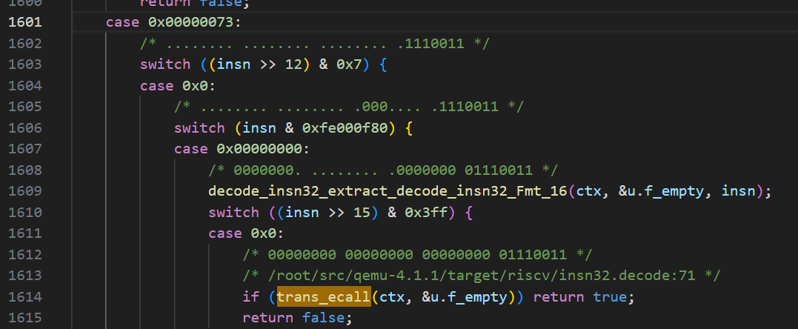
```

如图所示，在 `target/riscv/insn32.decode` 中，SYSTEM 类指令（opcode `0x73`）会进一步解析字段后分派到具体转接调用函数也就是`trans_ecall()`。


#### 3.2.2 转接：`trans_ecall()` 

```markdown
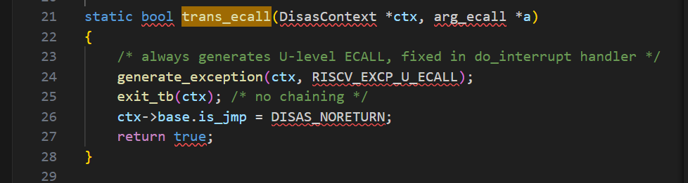
```

代码里通过`trans_ecall()`主要作用是让翻译好的指令调用相关的处理函数 ，交给后续异常提交流程处理，我们就不在这里过多讲解TCG有关的内容(下一部分内容会介绍TCG)，主要解释后面异常处理部分`riscv_cpu_do_interrupt`函数有关的内容。


#### 3.2.3 原因修正：用 `ecall_cause_map[env->priv]` 指明是哪种特权态下的ecall

```markdown
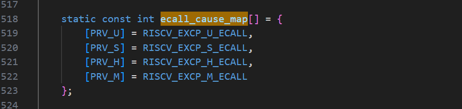
```

图中 `ecall_cause_map` 定义了不同特权态下 ecall 对应的异常原因编码（U/S/H/M 分别对应不同的 EXCP 常量），后面会说这有啥用。

```markdown
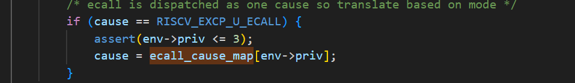
```

如图所示，在异常提交流程中，如果当前 `cause == RISCV_EXCP_U_ECALL`，会根据运行时 CPU 的 `env->priv` 将其替换为 `ecall_cause_map[env->priv]`。也就是在翻译期只表达“发生了 ecall”，在运行期提交前再根据真实特权态得到“到底是 U/S/M 哪一种 ecall”，之后才能根据特权态的不同来进行相应操作。


#### 3.2.4 异常提交：写 sepc/scause/mstatus，并跳转到 stvec，切换到 S-mode（或 M-mode）

```markdown
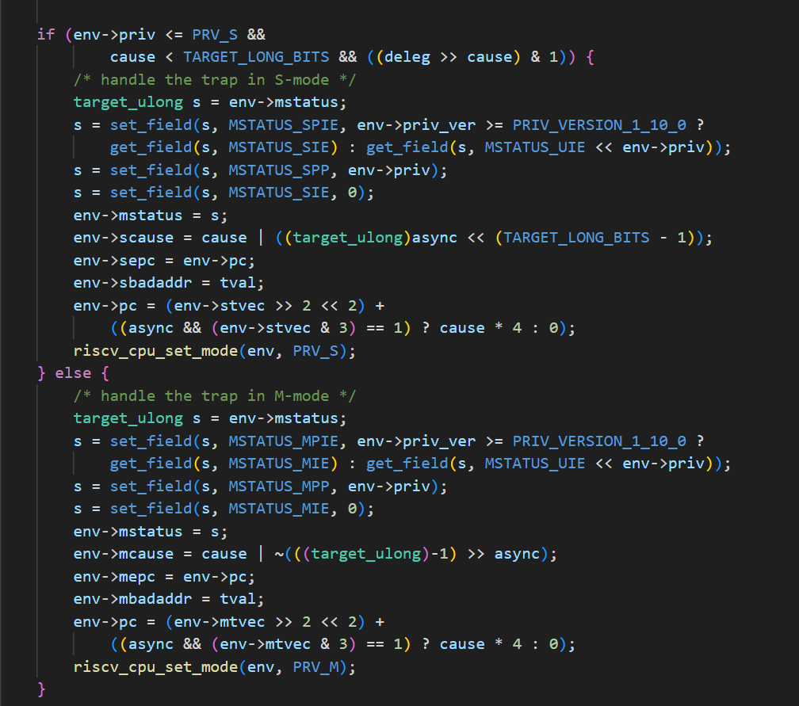
```

图中展示了异常提交时进入 S-mode 处理 trap 的关键语句（`handle the trap in S-mode` 分支），这部分就是我们处理U态的ecall指令的关键部分，其核心效果为：

* 更新 `mstatus`：保存陷入前状态并关闭/调整中断相关位（例如 SPIE/SIE/SPP 等字段的变换）；
* `env->scause = cause | ...`：写入异常原因（同步异常 `async=0`，不带中断标志位）；
* `env->sepc = env->pc;`：把触发异常时的 PC 记录到 `sepc`，作为后续 `sret` 返回的目标依据；
* `env->pc = ... stvec ...`：将 PC 设为 `stvec` 指向的 trap handler 入口（向量模式时会根据 cause 计算偏移）；
* `riscv_cpu_set_mode(env, PRV_S);`：将 CPU 特权态切换为 S-mode。

因此，从提交阶段可以总结：**QEMU 完成了“陷入内核”的全部关键动作：保存返回点（sepc）→记录原因（scause）→更新状态位（mstatus）→跳转到异常入口（stvec）→切换到 S-mode。**


#### 3.3 GDB 调试分析 ecall 指令（调试过程与结果）

本小节在 **Guest 侧已停在用户态 `ecall` 指令处（PC=0x8000104）** 的前提下，通过 **Host 侧 attach QEMU 并在异常提交入口下断点**，观察 QEMU 在运行期对 ecall 的实际处理效果（CSR 写入、PC 跳转、特权级切换等）。


##### 3.3.1 调试过程：从触发 ecall 到命中 QEMU 异常入口

1. **Guest 侧触发 ecall（窗口 B）**
   在 `syscall` 反汇编中执行点指向 `ecall` 后，执行一次单步：

   ```gdb
   si
   ```

这样就执行用户态 `ecall`，触发同步异常。

2. **Host 侧命中断点 `riscv_cpu_do_interrupt`（窗口 C）**
   执行 `si` 后，Host 侧 gdb 立即命中 QEMU 源码断点：

   ```
   Thread "qemu-system-ris" hit Breakpoint 1, riscv_cpu_do_interrupt (...) at target/riscv/cpu_helper.c:513
   ```

   说明：`ecall` 在 QEMU 中已进入**异常提交阶段**，对应的核心入口函数就是 `riscv_cpu_do_interrupt`。


##### 3.3.2 调试结果：BEFORE/AFTER 对比验证 QEMU 对 ecall 的关键操作

为观察 ecall 的处理效果，在断点处打印陷入前后关键字段。调试输出如下：

**（1）提交前状态 BEFORE：**
```markdown
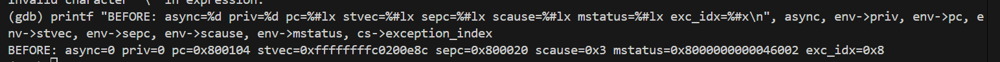
```
```
BEFORE: async=0 priv=0 pc=0x8000104 stvec=0xffffffffc0200e8c
        sepc=0x8000020 scause=0x3 mstatus=0x8000000000046002 exc_idx=0x8
```

解释要点：

* `async=0`：表明这是**同步异常**（与 ecall 的语义一致）。
* `priv=0`：当前处于 **U-mode**（用户态）。
* `pc=0x8000104`：PC 正是用户态 `ecall` 指令地址，说明异常提交发生在执行 ecall 的位置。
* `stvec=0xffffffffc0200e8c`：S 态 trap 入口地址（内核 trap 向量基址），后续 PC 应跳转到此处。
* `exc_idx=0x8`：QEMU 内部记录的异常索引（与 ecall 对应的异常编号相匹配，后续会写入 scause）。
*  其他部分是上次操作的遗留值，就先不做分析

**（2）提交后状态 AFTER：**
```markdown
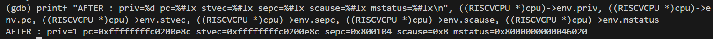
```
```
AFTER: priv=1 pc=0xffffffffc0200e8c stvec=0xffffffffc0200e8c
       sepc=0x8000104 scause=0x8 mstatus=0x8000000000046020
```

解释：

1. **特权级切换：`priv` 从 0 → 1**
   `priv=1` 表明 CPU 已切换到 **S-mode**，即进入内核异常处理上下文。

2. **陷入入口跳转：`pc` 从用户态 ecall 地址 → `stvec`**
   `pc=0xffffffffc0200e8c` 且与 `stvec` 相同，说明 QEMU 已将 PC 设置为 S 态 trap handler 入口，开始执行内核的 trap 处理代码。

3. **保存返回点：`sepc` 被写为 ecall 的地址**
   `sepc=0x8000104`，精确等于触发异常的 `pc`，说明 QEMU 在提交异常时将陷入点记录到 `sepc`，以便后续 `sret` 返回用户态时作为返回目标依据。

4. **写入异常原因：`scause` 更新为 0x8**
   `scause=0x8` 表明 ecall 的异常原因已写入 CSR。结合 3.2 的源码可知：翻译期统一生成占位 `U_ECALL`，提交期会根据当前特权态修正 cause，并最终写入 `scause`，表明当前是用户态ecall指令导致的异常。

5. **状态寄存器更新：`mstatus` 发生变化**
    由调试输出可见，陷入前后 mstatus 从 ...46002 变为 ...46020，只比较低 16 位即可得到 0x6002 → 0x6020，这等价于 bit1（0x2）被清零、bit5（0x20）被置 1。在 RISC-V 的 mstatus 定义中，bit1 对应 SIE（Supervisor Interrupt Enable，S 态中断使能），bit5 对应 SPIE（Supervisor Previous Interrupt Enable，陷入前 SIE 的备份），因此该变化可以具体解释为：陷入前 0x6002 & 0x2 = 0x2 表明 SIE=1（中断使能处于开启），而陷入后 0x6020 & 0x2 = 0 表明 SIE 被清零，同时 0x6020 & 0x20 = 0x20 表明 SPIE 被置为 1，即 QEMU 在提交 ecall 进入 S 态 trap 时执行了典型的 trap 进入规则——先将当前的中断使能状态备份到 SPIE（等价于 SPIE ← SIE），再关闭 SIE（SIE ← 0）以避免异常处理过程中被可屏蔽中断打断，并为后续 sret 返回时恢复中断状态提供依据。


### 3.4 QEMU 对 sret 的处理流程有关源码分析

本节对 QEMU 处理 `sret`（从 S-mode 返回到先前特权态）的关键路径进行说明。整体上，QEMU 对 `sret` 的处理同样遵循“**译码 → 转接 → helper 执行并改写 CPU 状态**”的链路：先在 `insn32.decode` 中识别 `sret`，再通过 `trans_sret()` 生成调用 helper 的 TCG 语义，最终由 `helper_sret()` 依据 `sepc/mstatus` 完成返回地址与特权级的恢复。


#### 3.4.1 译码：在 `insn32.decode` 中匹配 `sret` 并分派到 `trans_sret`

```markdown
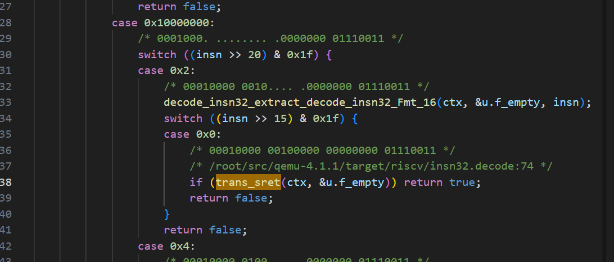
```

如图所示，在 `target/riscv/insn32.decode` 中，当 SYSTEM 指令（opcode `0x73`）进一步解析字段后匹配到 `sret` 的编码形式，就会进入对应分支并调用 `trans_sret(ctx, &u.f_empty)`。这一步就是**在译码阶段确认当前指令为 sret，并将其交给翻译器生成语义**。


#### 3.4.2 转接：`trans_sret()` 

```markdown
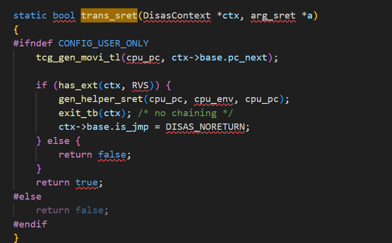
```


`trans_sret()` 就是让翻译好的sret指令调用相关处理函数，其中sret的主要操作是在`helper_sret()`中执行的，我们重点讲解这部分。


#### 3.4.3 执行：`helper_sret()` 依据 `sepc` 与 `mstatus` 恢复返回地址与特权态

```markdown
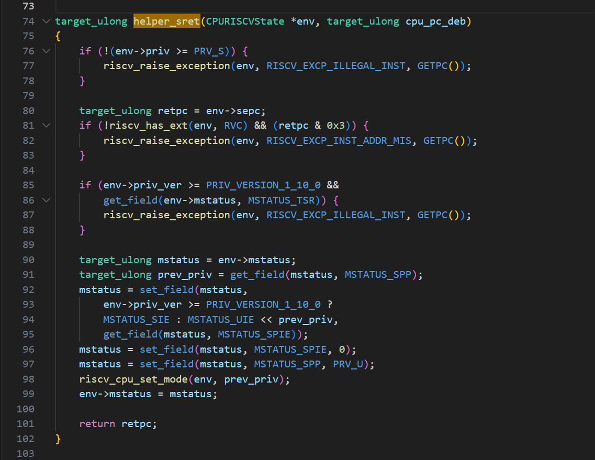
```

图中 `helper_sret(CPURISCVState *env, target_ulong cpu_pc_deb)` 展示了 sret 的关键执行语义，其核心步骤为：

1. **合法性检查（必须在 S-mode 执行）**
   `sret` 只能在特权态满足条件时执行（通常要求当前 `env->priv >= PRV_S`）。若不满足则通过 `riscv_raise_exception` 抛出非法指令异常，防止用户态伪造返回。

2. **确定返回 PC：`retpc = env->sepc`**
   `sepc` 在 trap 进入时保存了“陷入点/返回点”。因此 `helper_sret()` 通过读取 `env->sepc` 得到返回地址 `retpc`，并在末尾 `return retpc;`，使 CPU 从 trap handler 返回到被保存的地址继续执行。

3. **根据 `mstatus` 恢复返回特权态与中断使能状态**
   `helper_sret()` 会读取 `mstatus` 中与 S 态返回相关的字段（如 `SPP/SPIE` 等），将其转换为返回后的运行状态：

   * 从 `mstatus` 的 `SPP` 得到返回目标特权级（例如从 S 返回到 U）；
   * 用 `SPIE` 恢复 `SIE`（返回后中断使能恢复到陷入前状态）；
   * 按规范清理/更新相关位（例如将 `SPP` 清为 U 等），使得状态寄存器符合“已返回”的语义；
   * 调用 `riscv_cpu_set_mode(env, prev_priv)`，完成特权级恢复。

因此，`helper_sret()` 的整体效果可以概括为：**读取 `sepc` 作为返回地址，按 `mstatus` 恢复返回后的特权态与中断状态，并完成从 S-mode 返回到先前特权态（通常为 U-mode）的切换**。


#### 3.5 GDB 调试分析 sret 指令

本小节在 **Guest 侧已运行到内核返回路径 `__trapret` 附近（即将执行 `sret`）** 的前提下，通过 **Host 侧 attach QEMU 并在 `helper_sret` 处下断点**，观察 QEMU 在运行期对 `sret` 的实际处理效果（返回地址选择、特权级恢复、`mstatus` 位更新等）。

##### 3.5.1 调试过程：从命中 sret 到进入 QEMU 的 helper_sret

1. **Guest 侧定位到 `sret` 指令（窗口 B）**
   在 Guest 侧 gdb 的反汇编输出中可以看到当前执行位置已经来到 `__trapret`，并即将执行 `sret` 指令：

```markdown

```

2. **Host 侧在 QEMU 中对 `helper_sret` 下断点并继续运行（窗口 C）**
   由于 3.4 的源码分析表明：`trans_sret()` 在翻译期会生成对 `helper_sret()` 的调用，因此本节选择直接在 QEMU 的 `helper_sret` 入口处设置断点，用来捕获 `sret` 的运行期语义执行位置。命中断点的现象如下：

```markdown
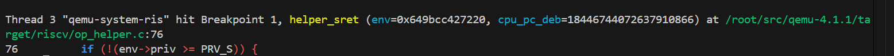
```

从图中可以确认：执行 `sret` 时，QEMU 进入了 `target/riscv/op_helper.c` 中的 `helper_sret`，说明 `sret` 的关键处理逻辑确实在 helper 中完成。


##### 3.5.2 调试结果：BEFORE/AFTER 对比验证 QEMU 对 sret 的关键操作

为观察 `sret` 的处理效果，在 `helper_sret` 断点处打印返回前后关键字段。为了防止函数生存周期的影响，本节先将 `$e` 指向 `env`：

```gdb
set $e = env
```

并分别在调用前后打印 `priv/pc/sepc/mstatus`：

```gdb
printf "BEFORE_sret: priv=%d pc=%#lx sepc=%#lx mstatus=%#lx\n", $e->priv, $e->pc, $e->sepc, $e->mstatus
...
printf "AFTER_sret:  priv=%d pc=%#lx sepc=%#lx mstatus=%#lx\n", $e->priv, $e->pc, $e->sepc, $e->mstatus
```

**（1）提交前状态 BEFORE：**

```markdown
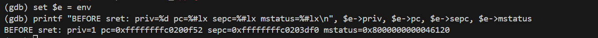
```

从 BEFORE 输出可以读出：

* `priv=1`：当前处于 **S-mode**，符合 `sret` 的执行前提（`sret` 是特权指令，必须在 S 态及以上执行）。
* `pc=0xffffffffc0200f52`：此时 PC 位于内核返回路径（`__trapret` 附近），即正在执行 trap 返回序列。
* `sepc=0xffffffffc0203df0`：`sepc` 保存了“trap 返回目标地址”，`helper_sret` 会将其作为 `retpc` 返回出去（这与 3.4 中源码的 `target_ulong retpc = env->sepc;` 一致）。
* `mstatus=...46120`：包含 `SPP/SPIE/SIE` 等返回相关状态位，后续会被 `helper_sret` 按规范调整。

**（2）执行 helper_sret 并观察返回值：**

在断点处执行：

```gdb
finish
```

`finish` 会运行到 `helper_sret` 返回，并在 gdb 中显示返回值（即 `helper_sret` 返回的 `retpc`）。截图中可以看到 “Value returned is $1 = ...”，随后通过 `p/x` 将其转换为十六进制：

```markdown
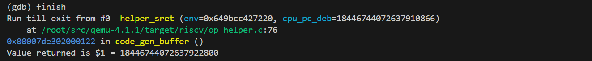

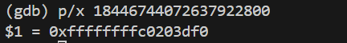
```

可以验证：`helper_sret` 的返回值与 BEFORE 中的 `sepc` 一致（`retpc == sepc`），这说明 QEMU 的 `sret` 返回地址选择确实来源于 `sepc`。

**（3）提交后状态 AFTER：**

```markdown
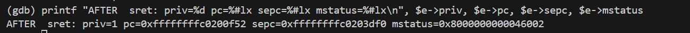
```

解释：

1. **返回地址由 `sepc` 提供**
   结合 `finish` 的返回值验证可知：`helper_sret` 返回的 `retpc` 等于进入时的 `sepc`，因此 `sret` 的“回到哪里继续执行”由 `sepc` 决定，后续这个`retpc`会在程序结束的那个exit函数中作为pc值决定下一个执行的指令，也就宣布返回到了异常调用之前的地址。

2. **`mstatus` 发生更新**
   AFTER 中 `mstatus` 相比 BEFORE 发生变化（例如从 `...46120` 变为 `...46002`），这说明 `helper_sret` 按照 sret 语义对 `mstatus` 的返回相关位进行了调整（典型行为包括：用 `SPIE` 恢复 `SIE`、清/重置 `SPP` 等），从而恢复 trap 发生前的运行状态。


### 四、QEMU 中 ecall 的 TCG 翻译流程（只是简单的看了下什么是TCG，打了断点观察了一下是否经过那些函数）

#### 背景知识：QEMU 的 TCG 动态二进制翻译机制

QEMU 是一种基于软件的全系统模拟器，其核心任务是在 Host 架构（如 x86-64）上正确模拟 Guest 架构（如 RISC-V）处理器的行为。由于 Host CPU 无法直接执行 Guest 指令，QEMU 采用了 **TCG（Tiny Code Generator）** 作为其核心的动态二进制翻译引擎。

TCG 的基本思想是：在程序运行过程中，将 Guest 指令动态翻译为一段等价的 Host 可执行代码，并在 Host 上执行该代码，从而在语义上模拟 Guest CPU 的执行效果。这一过程并非逐条指令即时翻译执行，而是以 **Translation Block（TB）** 为基本单位进行。

**1. Translation Block（TB）的概念**

Translation Block 是 QEMU 中指令翻译与缓存的基本单位，一个 TB 通常具有以下特征：

- 从某个 Guest 程序计数器（PC）开始；
- 包含一段顺序执行的 Guest 指令；
- 在遇到控制流可能发生变化的指令时终止。

控制流变化的典型情形包括：
- 条件或无条件跳转；
- 异常或中断；
- 系统调用指令（如 RISC-V 的 `ecall`）。

TB 一旦生成，其对应的 Host 代码会被缓存；当 Guest 再次执行到同一 PC 时，QEMU 可以直接复用该 TB，而无需重新翻译，从而显著提升执行效率。


**2. TCG 翻译的总体流程**

从整体上看，TCG 的执行流程可以概括为以下几个阶段：

1. **TB 查找（tb_find）**  
   QEMU 根据当前 Guest PC 查询是否已有对应的 TB。

2. **TB 生成（tb_gen_code）**  
   若未命中已有 TB，则创建新的 Translation Block，并启动翻译流程。

3. **指令翻译（gen_intermediate_code / translator_loop）**  
   QEMU 调用与 Guest 架构相关的翻译器，将 Guest 指令逐条翻译为 TCG 中间表示（TCG IR）。

4. **TB 执行（cpu_tb_exec）**  
   翻译完成后，TCG 将 IR 转换为 Host 可执行代码并执行，通过修改 QEMU 中维护的 Guest CPU 状态结构体来模拟指令语义。

**3. TCG IR 与 Guest CPU 状态模拟**

TCG IR 是 QEMU 内部定义的一种与具体硬件无关的中间表示，用于描述 Guest 指令的语义效果。  
在执行阶段，TCG 生成的 Host 代码并不直接操作真实硬件寄存器，而是通过读写 QEMU 中的 Guest CPU 状态结构体（如 `CPUArchState`）来实现：

- Guest 程序计数器（PC）的更新；
- 通用寄存器与 CSR 的读写；
- 特权级的切换。

因此，从 Guest 的视角来看，指令的执行效果与真实硬件一致；而从 Host 的视角来看，只是在执行一段普通的本地代码。


**4. 系统调用指令与 TB 边界的关系**

系统调用指令（如 RISC-V 的 `ecall`）在语义上会触发同步异常，其执行结果包括但不限于：

- 保存异常返回地址；
- 设置异常原因寄存器；
- 切换处理器特权级；
- 跳转到异常处理入口。

由于执行 `ecall` 后的下一条 PC 不再是顺序的 `pc + 指令长度`，而是由异常处理机制决定，因此该类指令天然构成 Translation Block 的终止边界。  
在 QEMU 的 TCG 模型中，这类指令通常会被单独翻译为一个 TB，以确保异常语义与控制流切换的精确模拟。


#### 4.1 设置 TCG 关键断点

在 QEMU-gdb（窗口 C）中，对以下函数设置断点：

* `translator_loop`
* `gen_intermediate_code`
* `tb_gen_code`
* `cpu_tb_exec`

当 guest 执行到 ecall（PC=0x800104）时，QEMU 若未命中已有 TB，会先通过 tb_gen_code 触发 TB 生成；随后 gen_intermediate_code 驱动翻译过程，并在 translator_loop 中调用 RISC-V 后端逐条将指令翻译为 TCG IR；生成完成后，TB 交由 cpu_tb_exec 执行，从而在 host 上模拟该条指令对 guest 状态（PC/CSR/特权级）的影响。


#### 4.2 命中翻译流程并观察调用栈

当 Guest 执行到 `ecall` 时，QEMU 依次命中以下断点：

* `tb_gen_code`
* `gen_intermediate_code`
* `translator_loop`


```markdown
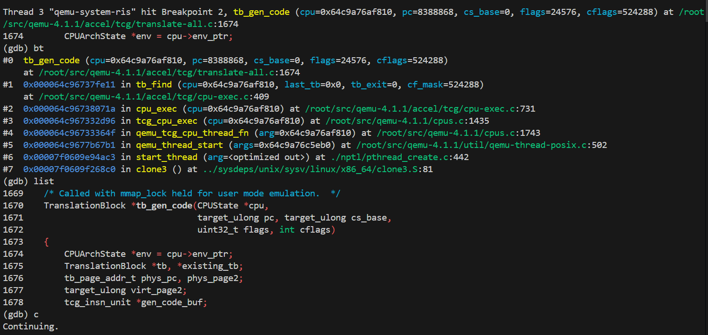
```

```markdown
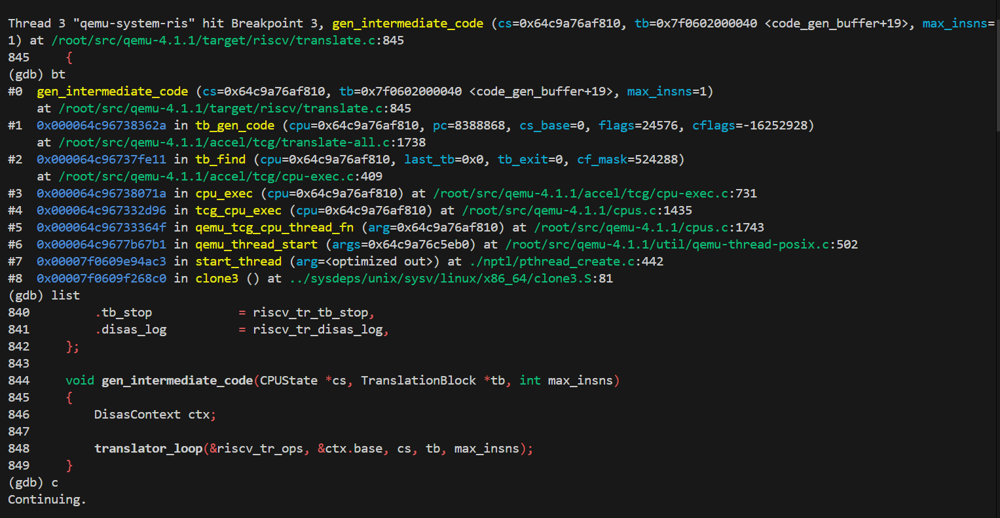
```

```markdown
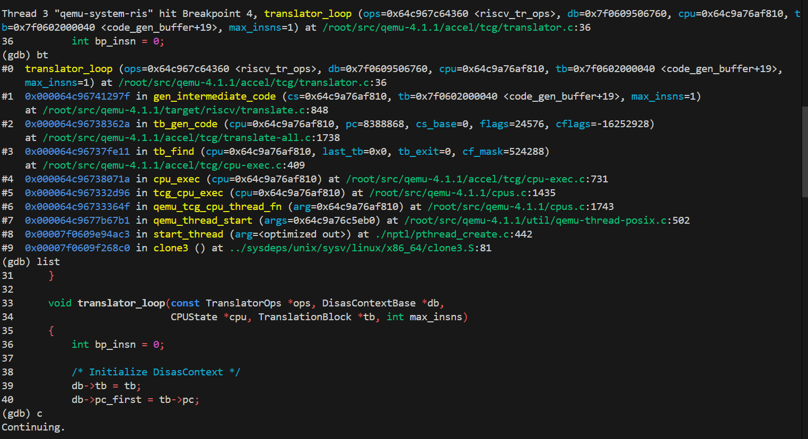
```

这说明 `ecall` **确实进入了 TCG Translation 流程**，而非被 QEMU 特判绕过。


#### 4.3 验证 ecall 被翻译为单指令 TB

在 `cpu_tb_exec` 断点处，打印 TB 信息：

```gdb
p/x ((TranslationBlock*)itb)->pc
p/x ((TranslationBlock*)itb)->size
```

得到结果：

* `TB.pc   = 0x800104`
* `TB.size = 0x4`
* `TB.pc + size = 0x800108`


```markdown
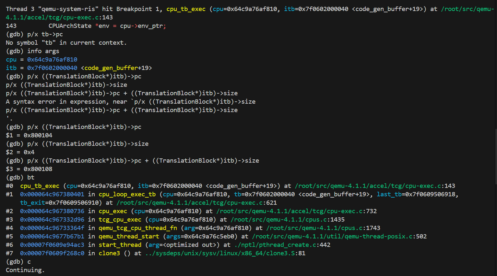
```

说明：

QEMU 将 `ecall` 单独翻译为一个仅包含该指令的 Translation Block，并在 `cpu_tb_exec` 中执行。


### 五、TCG Translation 的作用总结与对比

通过本实验可以明确看到：

* `ecall` / `sret` 与普通指令一样，均需经过 **TCG Translation**；
* 指令被翻译为 TB，再由 `cpu_tb_exec` 执行；
* 特权指令往往形成 **单指令 TB**，作为 TB 的边界。


### 六、调试过程中的抓马细节与收获

* 双重 GDB 容易出现“一个窗口停、另一个窗口卡住”的现象；
* 汇编标签（如 `__trapret`）无法直接用函数名断点，需要使用文件 + 行号；
* 在 QEMU 中查看 TB 时需要将 `itb` 强制转换为 `TranslationBlock*`。


### 七、大模型在实验中的作用

在实验过程中，大模型主要用于：

* 分析 Lab5 中用户程序的加载方式；
* 辅助定位 QEMU 中与 TCG 相关的关键函数；
* 帮助解释双重 GDB 卡住、sret 后再次命中 syscall 等现象；
* 将零散调试现象整理为完整、可解释的执行流程。